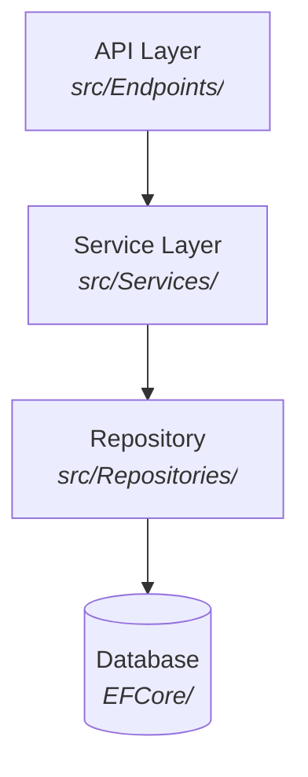
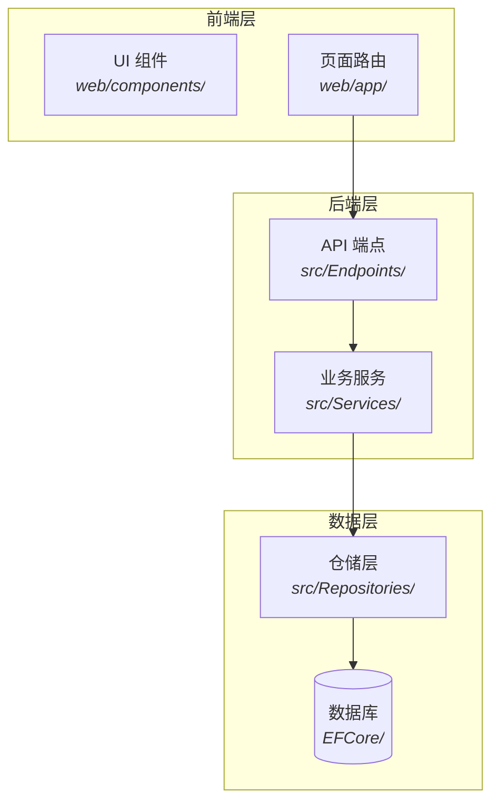
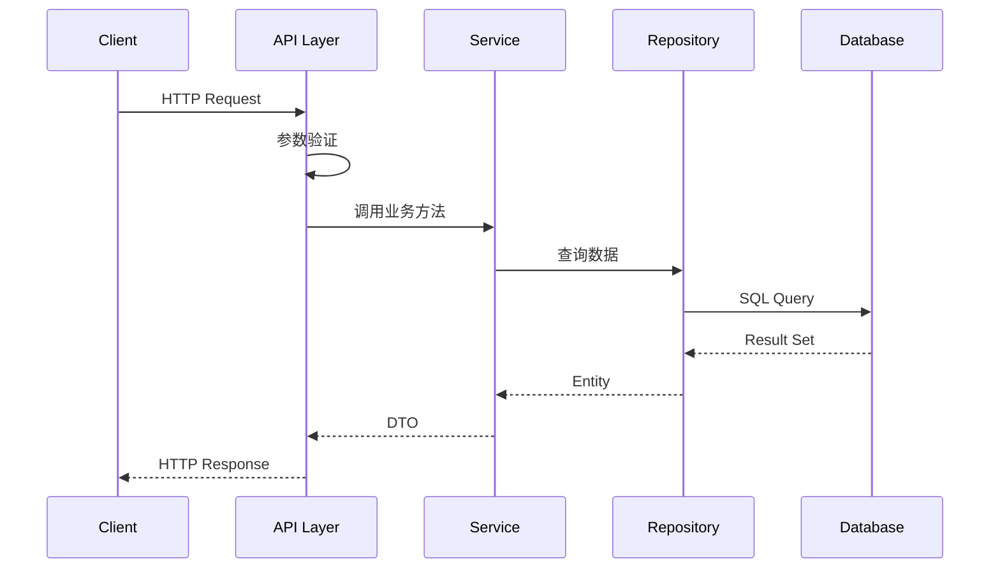
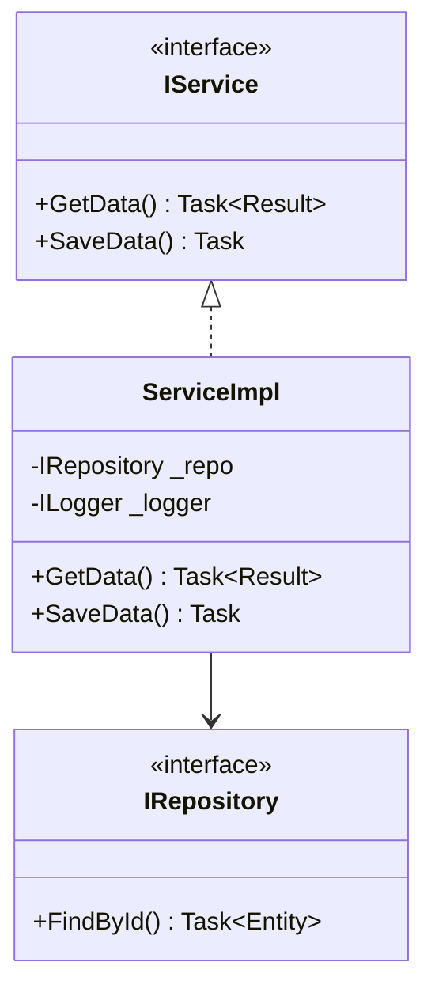
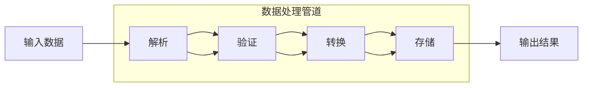
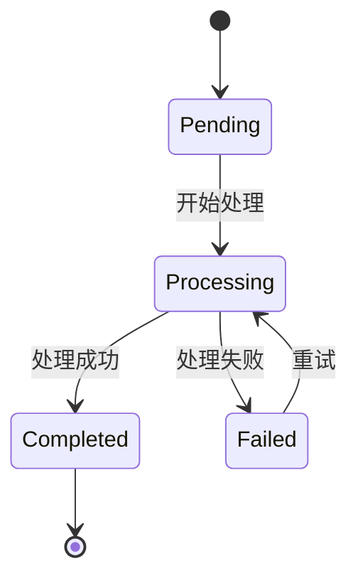
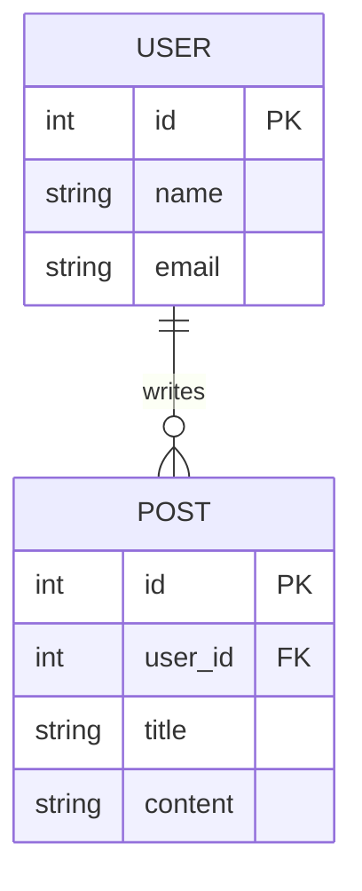
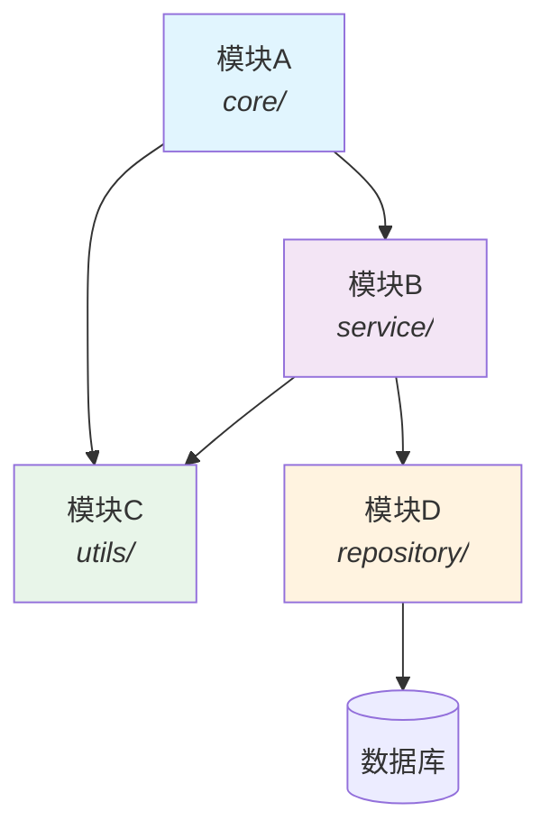

# 分析输出图表生成规范

> 🎨 源码分析的输出文档应包含 Mermaid 图表，让架构、数据流、调用链一目了然

## 核心理念

参考 DeepWiki/OpenDeepWiki 的做法：**分析产出不仅仅是文字，还应包含可视化图表**。

每个分析文档中，凡是能用图表说清楚的内容，都应该生成 Mermaid 图表。

## 支持的图表类型

| 图表类型 | Mermaid 语法 | 适用场景 |
|----------|-------------|----------|
| **架构图** | `flowchart TD` | 系统分层、模块关系 |
| **数据流图** | `flowchart LR` | 请求处理链路、数据管道 |
| **时序图** | `sequenceDiagram` | API 调用、组件交互 |
| **类图** | `classDiagram` | 核心类关系、继承体系 |
| **状态图** | `stateDiagram-v2` | 状态机、生命周期 |
| **ER 图** | `erDiagram` | 数据模型、表关系 |
| **思维导图** | `mindmap` | 模块分解、功能全景 |
| **甘特图** | `gantt` | 处理流程时间线 |
| **饼图** | `pie` | 代码分布、资源占比 |

## 图表生成规则

### 规则 1: 每个分析文档至少包含 1 个图表

| 文档类型 | 必须包含的图表 |
|----------|---------------|
| 架构分析 | 系统分层架构图 (flowchart TD) |
| 模块分析 | 模块依赖图 (flowchart) |
| 文件分析 | 类/函数依赖图 (classDiagram 或 flowchart) |
| 数据流分析 | 数据流图 (flowchart LR) |
| API 分析 | 时序图 (sequenceDiagram) |
| 状态管理 | 状态图 (stateDiagram) |
| 数据模型 | ER 图 (erDiagram) |
| 项目概览 | 思维导图 (mindmap) 或 架构图 |

### 规则 2: 图表必须基于实际代码

```
❌ 错误: 凭想象画架构图
✅ 正确: 阅读代码后，根据实际的 import/依赖/调用关系画图
```

### 规则 3: 图表中标注源码位置



### 规则 4: 图表风格统一

- 使用 `subgraph` 对模块分组
- 节点文字简洁，不超过 20 字
- 用 `""` 双引号包裹含特殊字符的文字
- 用 `<br/>` 换行
- 用 `<i>` 标注文件路径

## 图表模板库

### 1. 系统分层架构图



### 2. 请求处理链路图



### 3. 类关系图



### 4. 数据流图



### 5. 思维导图（项目全景）

```
mindmap
  root((项目名))
    核心架构
      API层
      服务层
      数据层
    关键特性
      特性A
      特性B
    技术栈
      前端
      后端
      存储
```

### 6. 状态图



### 7. ER 图



### 8. 模块依赖图



## 图表质量检查

每个图表生成后，自检：

- [ ] 节点文字是否简洁？（不超过 20 字）
- [ ] 是否标注了源码路径？
- [ ] 箭头方向是否正确？
- [ ] subgraph 分组是否合理？
- [ ] 是否基于实际代码？（不是凭空想象）
- [ ] Mermaid 语法是否正确？（避免渲染失败）

### 自动化检验

```bash
# 检验所有分析文档中的 mermaid 图表
python3 scripts/mermaid-validator.py output-dir/ --recursive -o output-dir/MERMAID_VALIDATION_REPORT.md
```

检验规则详见 [MERMAID_VALIDATION.md](MERMAID_VALIDATION.md)

**集成到验证流程**: 在 `verify-analysis.py --all` 和 `plan-tracker.py verify` 之后运行。

## 在不同模板中的应用

### 项目级分析 (00-README.md)

必须包含：
1. **系统全景图** (flowchart TD) - 展示整体架构分层
2. **核心数据流** (flowchart LR) - 展示主要请求处理链路

### 架构分析 (01-architecture.md)

必须包含：
1. **分层架构图** (flowchart TD + subgraph) - 详细展示各层组件
2. **模块依赖图** (flowchart) - 展示模块间依赖关系
3. **部署架构图** (flowchart) - 展示部署拓扑（如有）

### 文件级分析

必须包含：
1. **类/函数关系图** (classDiagram 或 flowchart) - 展示文件内核心关系
2. **调用链路图** (sequenceDiagram) - 展示关键方法的调用时序

### 专项分析

| 专项 | 必须包含的图表 |
|------|---------------|
| LLM Agent | Agent 工作流图 (flowchart) + 工具调用时序图 (sequence) |
| 数据库系统 | 查询执行计划图 (flowchart) + 存储引擎架构图 |
| 全栈 Web | 前后端交互时序图 + 路由结构图 |
| Pipeline | 管道阶段图 (flowchart LR) + 状态流转图 (stateDiagram) |

---
