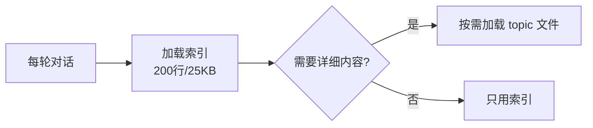

# 费曼学习文档生成指南

> 🎓 从源码分析文档中自动提炼关键知识点，生成完整的费曼学习文档。**全程自动化，无需人工交互。**

> **定位（2026-08 更新）**：本环节是分析闭环的**必做步骤**（A4），不再是可选动作——所有分析模式在验证通过后都执行。仅当用户明确说"不要学习文档"时跳过。派发纪律：卡片批同样走六段式 [DISPATCH]；DSH 环境 ≥2 张卡片时用 workflow 工具（`analysis-workflow.js` 的 `tasks` 数组）。

## 📋 概述

源码分析完成后，agent 自动从分析文档中提炼关键知识点，用费曼学习法生成完整的学习文档。

**核心理念**：如果你不能用简单语言把一个概念讲清楚，说明你还没有真正理解它。

**全自动流程**：agent 识别知识点 → 自问自答 → 生成完整文档。读者只需阅读，无需任何交互。

**产出位置**：`output-dir/40-learning/`

**唯一依赖**：文件写入工具（write）。不依赖任何外部插件或交互式工具。

## 🎯 费曼四步法（agent 自执行）

agent 对每个知识点自动执行费曼四步，全部写入文档：

| 费曼步骤 | agent 自动执行 | 文档输出 |
|----------|---------------|----------|
| **讲解 (Explain)** | 用简单语言讲清概念 + 代码示例 + mermaid 图 + 类比 | `## 📖 讲解` |
| **自问 (Self-Question)** | agent 自己对核心机制提问，并立即给出答案 | `## 🤔 核心问题` |
| **自判 (Self-Verify)** | agent 自己总结答案要点，验证讲解是否完整 | `## ✅ 要点总结` |
| **补漏 (Fill-Gap)** | agent 预判常见误解，主动澄清 | `## ⚠️ 常见误解` |

**关键区别**：不是让读者做题，而是 agent 自问自答，把思考过程完整呈现给读者。

## 🏗️ 文档结构

每张学习卡片是一个独立的 Markdown 文件：

```
40-learning/
├── INDEX.md                          # 学习文档索引
├── LEARN_01_[CONCEPT_NAME].md        # 第 1 张卡片
├── LEARN_02_[CONCEPT_NAME].md        # 第 2 张卡片
└── ...
```

## 📝 生成流程

### Step 1: 识别关键知识点

从分析文档中自动识别值得生成学习文档的关键知识点。优先级：

| 优先级 | 知识点类型 | 来源 |
|--------|-----------|------|
| **P0** | 核心设计原则（Golden Rules） | 各分析文档的"设计洞察"章节 |
| **P1** | 隐含陷阱（Gotchas） | 各分析文档的"隐含陷阱"章节 |
| **P2** | 关键架构模式 | 架构分析文档 |
| **P3** | 重要算法/数据结构 | 文件级分析文档 |

**识别标准**：
- ✅ 可移植：能应用到其他项目
- ✅ 非显而易见：不是常识，需要深入理解
- ✅ 有代码证据：能从源码中找到具体实现
- ❌ 过于具体：只适用于当前项目
- ❌ 过于通用：已经是常识（如"单一职责原则"）

### Step 2: 费曼四步自执行

对每个知识点，agent 自动完成四步：

**1. 讲解**：
- 用简单语言讲清概念（非技术人也能懂）
- 给出最小代码示例（不是项目源码的完整复制）
- 画 mermaid 图可视化核心机制
- 给一个生活化类比

**2. 自问**：
- agent 自己对核心机制提出 2-3 个问题
- 立即给出完整答案
- 示例：
  - 问："为什么记忆索引要限制在 200 行？"
  - 答："因为索引在每轮对话中都会加载，成本固定。如果无界增长，每轮 token 消耗会失控。"

**3. 自判**：
- agent 总结 3-5 个答案要点
- 验证讲解是否覆盖了所有要点
- 如果有遗漏，补充讲解

**4. 补漏**：
- agent 预判 2-3 个常见误解
- 主动澄清误解 vs 正确理解
- 示例：误解"索引限制是为了节省存储空间" → 正确"是为了控制每轮的固定成本"

### Step 3: 生成文档

每张学习卡片生成一个 Markdown 文件，命名规范：`LEARN_[序号]_[CONCEPT_NAME].md`

`CONCEPT_NAME` 用概念名的 kebab-case。

### Step 4: 生成索引

`INDEX.md` 包含所有学习文档的索引和学习路径建议。

**卡片分类（INDEX 按此组织，4 类）**：

| 分类 | 收录标准 | 示例 |
|------|---------|------|
| 🏗️ 设计模式 | 可移植的架构/设计手法 | 存储抽象工厂、Map-Reduce 摘要 |
| ⚡ 并发与性能 | 并发治理/限流/缓存/性能权衡 | 优先级并发管线、LLM 缓存策略 |
| ⚠️ 隐含陷阱 | 反直觉行为、静默失败、升级坑 | KEEP 模式静默丢数据、asdict 双视图 |
| 🧭 架构决策 | 关键取舍及其理由（为什么不用 X） | 值传递 vs 单例、分隔符协议 vs JSON |

**INDEX 维护纪律**：卡片重试/补生成成功后**必须回写 INDEX**——清除 ⏳ 标记并把卡片归入对应分类（verify-analysis 的"陈旧待生成标记"检查会拦截漏回写）。

**命名规范**：`LEARN_NN_<CONCEPT_SNAKE_CASE>.md`，其中 CONCEPT 全大写蛇形——多词缩写词按原词小写化整体转写（正确：`ASDICT_DUAL_VIEW`，实战错例：`ASdict_DUAL_VIEW` 混杂大小写导致按名检索失败）。

## 📋 学习文档模板

```markdown
# [概念标题]

> [一句话白话总结]

## 📖 讲解

### [小节标题]

[用简单语言讲解概念]

**类比**：[生活化类比]

**代码示例**：
```[language]
[最小可运行示例]
```

**架构图**：
```mermaid
[mermaid 图源码]
```

## 🤔 核心问题

### Q1: [agent 提出的问题]

**A**: [agent 给出的完整答案]

### Q2: [agent 提出的问题]

**A**: [agent 给出的完整答案]

## ✅ 要点总结

这个概念的核心要点：

1. **[要点 1]**：[说明]
2. **[要点 2]**：[说明]
3. **[要点 3]**：[说明]

## ⚠️ 常见误解

### 误解 1：[误解描述]

**正确理解**：[正确解释]

### 误解 2：[误解描述]

**正确理解**：[正确解释]

## 🔗 延伸阅读

- 来源分析文档：[链接]
- 相关概念卡片：[链接]

---

*知识点来源：[分析文档路径]*
```

## 🎨 质量检查

agent 生成文档后自动检查：

| 维度 | 检查项 |
|------|--------|
| **标题** | 一句话能说清的概念名？ |
| **摘要** | 一句话白话总结？非技术人也能懂？ |
| **讲解** | 用简单语言？有代码示例？有类比？ |
| **核心问题** | 覆盖核心机制？答案完整？ |
| **要点总结** | 要点完整？与讲解一致？ |
| **常见误解** | 针对易错点？纠正清晰？ |
| **无人工依赖** | 读者只需阅读，无需做任何交互？ |

## 📊 预计产出

| 分析模式 | 预计学习文档数量 |
|----------|-----------------|
| Layer 1（项目级） | 3-5 张 |
| Layer 2（模块级） | 5-10 张 |
| Layer 3（文件级） | 10-20 张 |
| 递归深度分析 | 20-50 张 |

## 💡 完整示例

### 输入：分析文档中的知识点

来源：`LLM_AGENT_04_MEMORY_SYSTEM.md` 的"设计洞察"章节

> **原则**: 记忆索引是有界上下文，详细内容应延迟加载
>
> **原理**: 索引在每轮对话中都会加载，成本固定；详细内容按需加载，成本可控。如果索引无界增长，每轮 token 消耗会失控。
>
> **证据**: 项目将 MEMORY.md 索引限制在 200 行/25KB，完整内容存放在独立 topic 文件中，Agent 按需 recall

### 输出：自动生成的学习文档

文件：`40-learning/LEARN_01_BOUNDED_MEMORY_INDEX.md`

```markdown
# 记忆索引是有界上下文

> 索引每轮都加载，必须小；详细内容按需加载，可以大。

## 📖 讲解

### 什么是有界上下文？

想象你有一本百科全书，但你不可能每次回答问题都把整本书读一遍。你会：
1. 先看目录（索引），找到相关章节
2. 只读需要的章节（详细内容）

记忆系统也是这样：
- **索引**：每轮对话都加载，告诉你"有哪些记忆"
- **详细内容**：按需加载，只在需要时读取

**类比**：索引就像图书馆的检索系统，详细内容就像书架上的书。你不可能每次去图书馆都把整个图书馆读一遍。

**代码示例**：
```python
# 索引：轻量级，每轮都加载
memory_index = [
    {"id": "mem_001", "summary": "用户偏好 Python", "topic": "user_prefs"},
    {"id": "mem_002", "summary": "项目使用 FastAPI", "topic": "project_info"},
]

# 详细内容：按需加载
def recall_memory(memory_id):
    return load_topic_file(memory_id)
```

**架构图**：


## 🤔 核心问题

### Q1: 为什么索引要限制在 200 行？

**A**: 因为索引在每轮对话中都会加载到上下文，是固定成本。如果索引无界增长，每轮的 token 消耗会失控。200 行/25KB 是一个经验值，既能覆盖足够多的记忆条目，又不会占用过多上下文窗口。

### Q2: 为什么不直接把详细内容也放在索引里？

**A**: 因为大部分记忆在大部分轮次中都不需要。把详细内容全放进去 = 每轮都付费读取不需要的信息。分离后，只为实际使用的详细内容付费。

### Q3: 这个设计的代价是什么？

**A**: 多了一次"按需加载"的开销（读取 topic 文件）。但这个开销只在需要时发生，远小于每轮都加载全部内容的成本。

## ✅ 要点总结

1. **索引是固定成本**：每轮都加载，必须控制在合理大小
2. **详细内容是可变成本**：按需加载，只在需要时发生
3. **分离设计**：索引小且快，详细内容大但按需
4. **本质**：用一次小的额外开销（按需加载）换取每轮固定成本的大幅降低

## ⚠️ 常见误解

### 误解 1：索引限制是为了节省存储空间

**正确理解**：不是为了节省存储空间，而是为了控制每轮的**固定成本**。存储空间可以很大，但每轮都要加载的索引必须小。

### 误解 2：索引越详细越好

**正确理解**：索引应该是一行摘要（~150 字符），不是完整内容。详细内容的放大会导致索引膨胀，失去"有界"的意义。

## 🔗 延伸阅读

- 来源分析文档：`10-module-deep/memory/00-overview/README.md`
- 相关概念卡片：`LEARN_02_LAZY_LOADING.md`

---

*知识点来源：LLM_AGENT_04_MEMORY_SYSTEM.md §8.1 设计洞察*
```

---

*模板版本: v1.1 - 全自动生成，无需人工交互*
