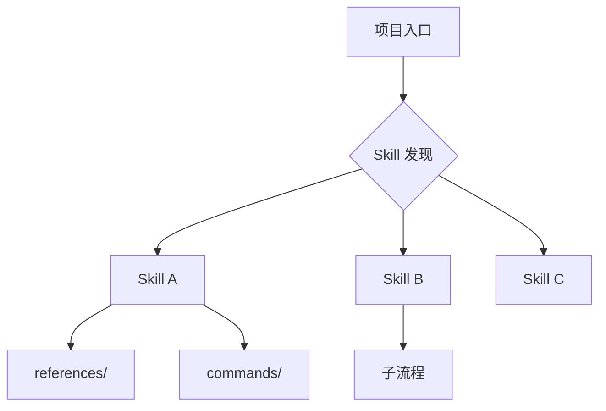

# SKILL 01 - 架构设计分析

> **核心问题**: Skill 项目如何组织？单体还是套件？层级结构如何？清单管理机制？

## 1. Skill 组织形式

### 1.1 架构类型识别

| 类型 | 特征 | 分析重点 |
|------|------|----------|
| **单体 Skill** | 一个 SKILL.md 自包含全部逻辑 | 指令完整性、自给自足能力 |
| **Skill 套件** | 多个 Skill 协作，共享设计哲学 | Skill 间依赖、协作模式、一致性 |
| **Skill 生态/平台** | Skill 发现 + 管理 + 执行 + 扩展 | 发现机制、生命周期管理、插件体系 |
| **领域 Skill 包** | 针对特定领域的 Skill 集合 | 领域覆盖度、领域建模质量 |

### 1.2 目录结构分析

```
检查要点:
├── SKILL.md / metadata.json     → 元数据完整性
├── skills/                       → Skill 存放位置
│   ├── skill-a/SKILL.md
│   └── skill-b/SKILL.md
├── references/                   → 参考文档（Skill 引用的知识库）
├── commands/ 或 .claude/commands/→ 命令式入口
├── agents/                       → 预定义 Agent 角色
├── evals/                        → 评估测试
└── AGENTS.md / CLAUDE.md         → 项目级指令
```

### 1.3 层级设计

```
是否存在显式的层级结构？
  ├── 单层: 所有 Skill 平级
  ├── 两层: 套件(Suite) → 单体(Skill)
  └── 多层: 平台 → 套件 → Skill → 子流程
```

## 2. Skill 清单管理

### 2.1 元数据设计

```yaml
# 检查 metadata.json / frontmatter
required_fields:
  - name: Skill 唯一标识
  - description: 一句话描述（触发依据）
optional_fields:
  - when_to_use: 触发条件
  - version / hash: 版本控制
  - license: 许可证
  - depends_on: 依赖的其他 Skill
  - tools_required: 需要的工具
  - platform: 目标平台
```

### 2.2 清单注册机制

- **静态清单**: MANIFEST.md / 显式注册文件
- **动态发现**: 扫描目录 + 解析 frontmatter
- **混合模式**: 静态优先 + 动态补充
- **去重机制**: 多来源 Skill 的 canonical path 去重

## 3. 核心分析问题清单

- [ ] Skill 的核心组织单位是什么？（单体/套件/平台）
- [ ] 有多少个 Skill？它们之间的关系是什么？
- [ ] 是否有显式的依赖声明？如何管理 Skill 间依赖？
- [ ] 目录结构是否清晰？新 Skill 应该放在哪里？
- [ ] 元数据是否完整？发现机制是否可靠？
- [ ] 是否有版本管理？Skill 如何演进和升级？
- [ ] 是否有 Skill 生命周期管理？（创建→审核→发布→废弃）

## 4. Golden Rules 提炼

*从该项目的架构设计中提炼可移植的设计原则*

### 模板

```
原则 N: [名称]
**观察**: 在该项目中，[具体实现方式]
**抽象**: [去掉项目名/平台名后的通用原则]
**去名检验**: ✅/❌ [去掉具体名称后原则是否成立]
**适用场景**: [何时应用此原则]
```

## 5. Gotchas（非显而易见的陷阱）

*从源码分析中发现的隐性设计决策*

### 检测方法

1. 查找 Skill 中的 `WARNING` / `IMPORTANT` / `NEVER` / `MUST` 强调
2. 查找 `Anti-Rationalization` 反模式声明
3. 查找 `Do not` / `Never` 等禁止性指令
4. 查找看似冗余但实际防御性的约束
5. 查找跨 Skill 的隐含假设

## 6. 可移植架构模式

### 常见 Skill 架构模式

| 模式 | 描述 | 示例 |
|------|------|------|
| **Mini 全能型** | 单个 Skill 压缩全套件核心逻辑 | mini-superpowers, mini-gstack |
| **领域套件型** | 多 Skill 按领域组织，共享设计哲学 | pm-skills (5 领域套件) |
| **生命周期型** | Skill 按开发阶段组织 (Define→Plan→Build→Verify→Ship) | agent-skills |
| **能力叠加型** | 每个 Skill 独立能力，按需组合 | code-agent-skills/openspec |
| **Hub-Spoke 型** | 核心 Skill + 外围扩展 | Skill_Seekers |

## 7. Mermaid 图表

### Skill 架构图（必须生成）


