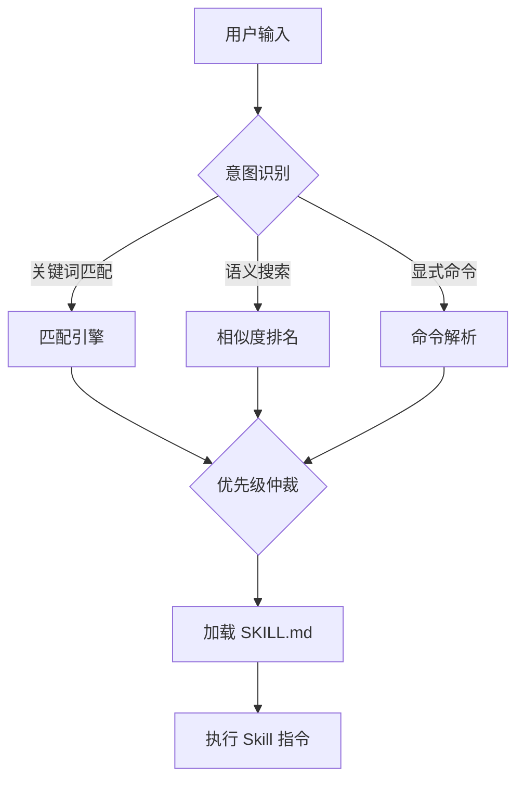
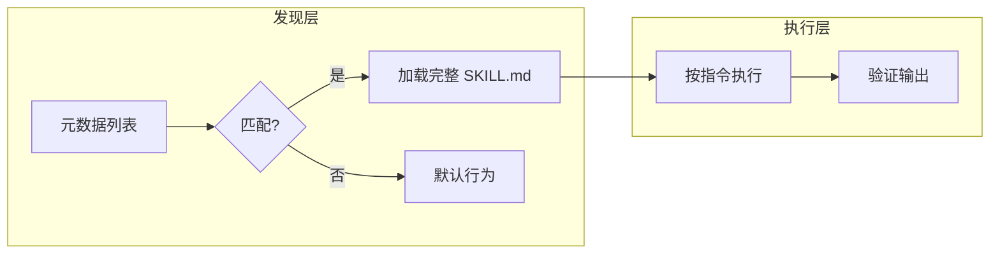

# SKILL 02 - 触发与路由分析

> **核心问题**: 用户意图如何映射到 Skill？关键词匹配？语义搜索？优先级仲裁？冲突处理？

## 1. 发现机制

### 1.1 发现策略分析

| 策略 | 描述 | 特征 |
|------|------|------|
| **关键词触发** | 在 description/when_to_use 中定义触发词 | 简单可靠，覆盖面有限 |
| **语义匹配** | 向量嵌入 + 相似度搜索 | 灵活，但需要嵌入基础设施 |
| **意图分类** | LLM 先分类意图，再路由到 Skill | 精确，但增加一次 LLM 调用 |
| **显式调用** | 用户通过命令/菜单主动选择 Skill | 无歧义，用户体验重 |
| **预算约束发现** | 元数据进入常驻上下文，完整内容延迟加载 | Token 高效 |

### 1.2 触发准确度评估

```
检查要点:
- description 是否前置触发语言？尾部可能被截断
- when_to_use 是否包含足够多触发词？
- 是否有反例？（什么情况不应触发）
- 多 Skill 竞争时如何仲裁？
```

## 2. 意图路由

### 2.1 路由决策树



### 2.2 优先级与冲突

检查项目是否处理以下冲突场景：

| 冲突场景 | 处理方式 |
|----------|----------|
| 多个 Skill 同时匹配 | 优先级数字 / 声明顺序 / LLM 裁决 |
| 通用 Skill vs 专用 Skill | 特异性优先 / 就近原则 |
| 嵌套 Skill 触发 | 父 Skill 控制 / 独立触发 |
| 相似名称冲突 | 命名空间 / canonical path 去重 |
| 隐式 vs 显式触发 | 显式优先 / 用户覆盖 |

### 2.3 反合理化机制

```
检查项目是否包含 Anti-Rationalization 声明:

典型模式:
"以下想法是错误的，必须忽略:
- '这太小了，不需要 Skill'
- '我可以快速直接实现'
- '我先收集上下文再说'
→ 这些想法会导致跳过 Skill 流程，必须抵制"
```

## 3. 核心分析问题清单

- [ ] Skill 如何被发现？（元数据列表 / 语义搜索 / 命令）
- [ ] description 字段是否前置了关键触发词？
- [ ] 是否有 when_to_use 字段？是否包含足够触发信号？
- [ ] 多 Skill 竞争时如何决定优先级？
- [ ] 是否有反理性化机制防止 Agent 绕过 Skill？
- [ ] 触发的延迟和成本如何？（Token 消耗 / LLM 调用次数）
- [ ] 是否有 Skill 发现失败后的 fallback 机制？

## 4. Golden Rules 提炼

### 常见可移植原则

- **前置触发语言**: description 的前 N 字符决定可发现性，尾部会被截断
- **元数据预算**: 全部 Skill 元数据总大小应 < 上下文窗口的 1%
- **显式优于隐式**: 有歧义时，宁可让用户显式选择
- **反理性化必要**: Agent 会找理由跳过流程，必须有显式禁止
- **触发词覆盖面**: 每个 Skill 至少 3-5 个触发词变体

## 5. Gotchas

### 典型陷阱

- **截断陷阱**: Skill 元数据列表超过 Token 预算时尾部被静默截断
- **幻觉触发**: LLM 在没有匹配 Skill 时可能"幻觉"出一个不存在的命令
- **理性化绕过**: Agent 可能合理化"这个任务太小不需要走 Skill 流程"
- **优先级倒置**: 通用 Skill 分数高于专用 Skill 导致误触发
- **隐式触发歧义**: "我想优化性能"可能触发 3 个不同 Skill

## 6. Mermaid 图表

### 触发流程图（必须生成）


