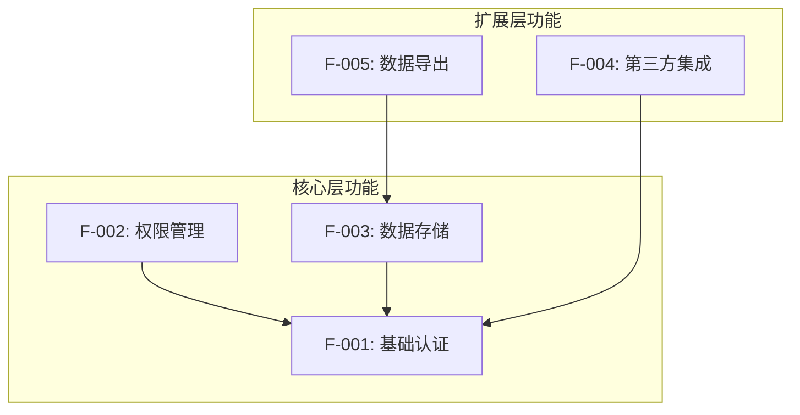
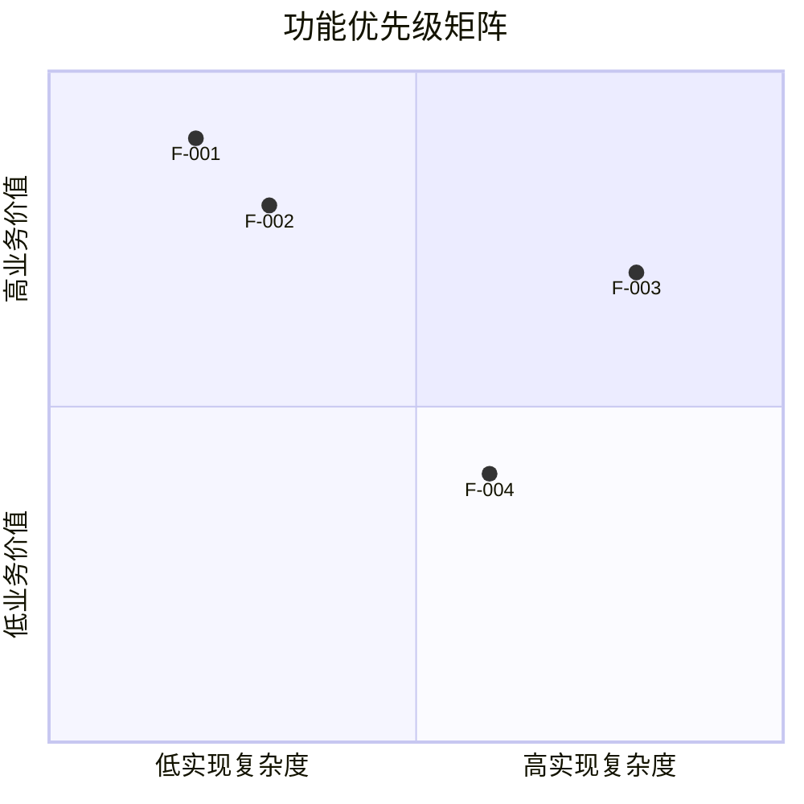
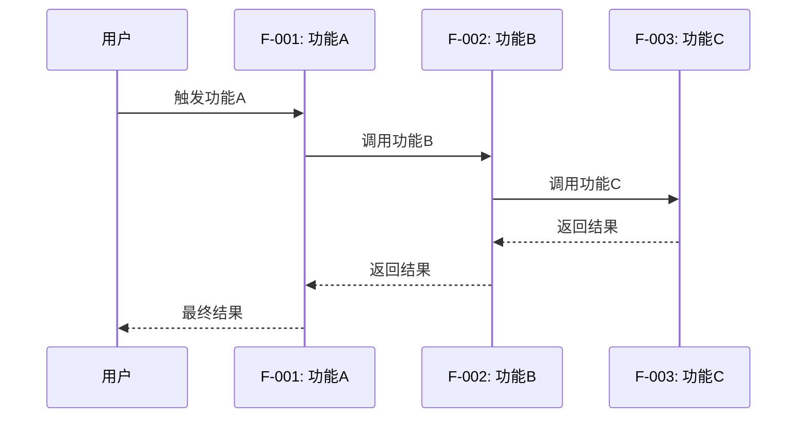
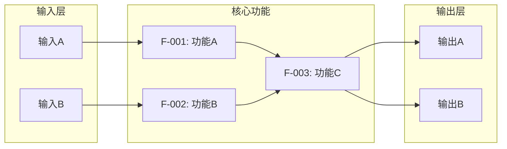
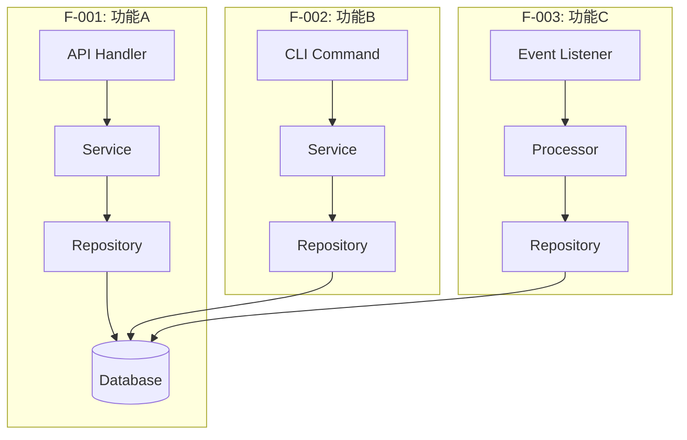

# 核心功能分析模板

> 🎨 图表要求：功能依赖/流程用结构图之外，涉及**内存布局、消息/序列化格式、网络协议帧、文件格式**的功能，必须画 ASCII 字节/内存布局图（方向+尺寸+偏移+指针四要素），范式见 `guides/DIAGRAM_GENERATION_GUIDE.md` 第三类。设计决策处至少 1 张讲解型图（对比/权衡/演进），见第二类。

## 文档目的

系统化分析项目的核心功能，识别功能分类、优先级、依赖关系、应用场景和边界条件，为深度理解项目价值提供结构化视角。

## 模板结构

```markdown
# [项目名] - 核心功能分析

## 1. 功能概览

### 1.1 功能定义

**核心功能**: 项目提供的、解决核心问题的基础能力集合

**功能边界**: 核心功能与辅助功能的区分标准

### 1.2 功能分类体系

```
功能分类树：
├── 核心层（必需）
│   ├── 功能 A
│   └── 功能 B
├── 扩展层（可选）
│   ├── 功能 C
│   └── 功能 D
└── 集成层（第三方）
    ├── 功能 E
    └── 功能 F
```

## 2. 核心功能识别与分类

### 2.1 功能清单

| 功能ID | 功能名称 | 功能层级 | 必需性 | 状态 |
|--------|----------|----------|--------|------|
| F-001 | [功能名] | 核心层 | 必需 | 已实现 |
| F-002 | [功能名] | 核心层 | 必需 | 已实现 |
| F-003 | [功能名] | 扩展层 | 可选 | 已实现 |
| ... | ... | ... | ... | ... |

### 2.2 功能分类矩阵

| 分类维度 | 分类标准 | 功能清单 |
|----------|----------|----------|
| **按价值** | 核心价值功能 | ... |
|  | 支撑价值功能 | ... |
|  | 增值功能 | ... |
| **按频率** | 高频使用 | ... |
|  | 中频使用 | ... |
|  | 低频使用 | ... |
| **按复杂度** | 简单功能 | ... |
|  | 中等复杂度 | ... |
|  | 复杂功能 | ... |
| **按依赖** | 独立功能 | ... |
|  | 依赖功能 | ... |
|  | 被依赖功能 | ... |

### 2.3 功能依赖关系图



### 2.4 功能优先级分析

#### MoSCoW 分类

| 分类 | 功能ID | 功能名称 | 理由 |
|------|--------|----------|------|
| **Must have** | F-001, F-002 | ... | 项目核心价值，不可或缺 |
| **Should have** | F-003, F-004 | ... | 重要但可暂时缺失 |
| **Could have** | F-005, F-006 | ... | 优化体验，非必需 |
| **Won't have** | F-007, F-008 | ... | 暂不实现，未来考虑 |

#### 价值-复杂度矩阵



**优先级排序**:
1. 高价值-低复杂度（立即实现）
2. 高价值-高复杂度（重点规划）
3. 低价值-低复杂度（按需实现）
4. 低价值-高复杂度（暂不实现）

## 3. 核心功能深度分析

### 3.1 [功能名称] (F-001)

#### 3.1.1 功能定义

**功能名称**: [功能名称]

**功能ID**: F-001

**功能描述**: [功能是什么，解决什么问题]

**功能价值**: [为什么这个功能重要]

#### 3.1.2 应用场景

| 场景ID | 场景名称 | 场景描述 | 触发条件 | 预期结果 |
|--------|----------|----------|----------|----------|
| S-001 | [场景名] | [场景描述] | [触发条件] | [预期结果] |
| S-002 | [场景名] | [场景描述] | [触发条件] | [预期结果] |

**典型用例**:

```
用例 1: [用例名称]
  前置条件: [前置条件]
  操作步骤:
    1. [步骤1]
    2. [步骤2]
    3. [步骤3]
  预期结果: [预期结果]
  异常处理: [异常处理]
```

#### 3.1.3 功能输入输出

**输入参数**:

| 参数名 | 参数类型 | 必填 | 默认值 | 约束条件 | 说明 |
|--------|----------|------|--------|----------|------|
| param1 | String | 是 | - | 长度≤100 | ... |
| param2 | Integer | 否 | 10 | 1-1000 | ... |

**输出结果**:

| 结果字段 | 类型 | 说明 | 可能值 |
|----------|------|------|--------|
| field1 | String | ... | ... |
| field2 | Integer | ... | ... |

#### 3.1.4 功能边界与限制

**功能边界**:
- ✅ [边界1]: 描述
- ✅ [边界2]: 描述

**功能限制**:
- ⚠️ [限制1]: 描述
- ⚠️ [限制2]: 描述

**不支持的场景**:
- ❌ [场景1]: 描述
- ❌ [场景2]: 描述

#### 3.1.5 功能依赖

**上游依赖**:
- 功能依赖: [F-XXX] - 说明
- 数据依赖: [数据源] - 说明
- 环境依赖: [环境要求] - 说明

**下游被依赖**:
- [F-XXX]: 说明
- [F-XXX]: 说明

**依赖关系图**:


#### 3.1.6 功能度量指标

| 指标类别 | 指标名称 | 目标值 | 当前值 | 测量方法 |
|----------|----------|--------|--------|----------|
| **性能** | 响应时间 | <100ms | ? | benchmark |
| **性能** | 吞吐量 | >1000 QPS | ? | 压测 |
| **质量** | 成功率 | >99.9% | ? | 监控统计 |
| **可用性** | SLA | 99.95% | ? | 统计 |

### 3.2 [功能名称] (F-002)

[同上结构]

...

## 4. 功能交互流程

### 4.1 核心功能流程图



### 4.2 跨功能数据流



## 5. 功能对比分析

### 5.1 与竞品功能对比

| 功能 | 本项目 | 竞品A | 竞品B | 差异说明 |
|------|--------|-------|-------|----------|
| F-001 | ✅ 已实现 | ✅ 已实现 | ❌ 未实现 | 本项目与竞品A功能相当 |
| F-002 | ✅ 已实现 | ⚠️ 部分 | ✅ 已实现 | 本项目实现更完整 |
| F-003 | ❌ 未实现 | ✅ 已实现 | ✅ 已实现 | 未来规划 |

### 5.2 功能优势与劣势

**功能优势**:
- ✅ [优势1]: 具体说明
- ✅ [优势2]: 具体说明

**功能劣势**:
- ⚠️ [劣势1]: 具体说明
- ⚠️ [劣势2]: 具体说明

**改进建议**:
1. [建议1]: 具体说明
2. [建议2]: 具体说明

## 6. 功能演进历史

### 6.1 版本演进

| 版本 | 新增功能 | 改进功能 | 废弃功能 | 发布时间 |
|------|----------|----------|----------|----------|
| v1.0 | F-001, F-002 | - | - | YYYY-MM-DD |
| v1.1 | F-003 | F-001 | - | YYYY-MM-DD |
| v2.0 | F-004 | F-002 | - | YYYY-MM-DD |

### 6.2 功能路线图

| 优先级 | 功能ID | 功能名称 | 计划版本 | 预计时间 |
|--------|--------|----------|----------|----------|
| P0 | F-005 | [功能名] | v2.1 | Q3 2026 |
| P1 | F-006 | [功能名] | v2.2 | Q4 2026 |
| P2 | F-007 | [功能名] | v3.0 | 2027 |

## 7. 功能实现逻辑追踪

> **目的**: 将"功能是什么"与"代码怎么实现"连接起来，追踪每个核心功能的完整调用链。
> 深度实现逻辑分析详见 [FEATURE_IMPLEMENTATION_LOGIC.md](./FEATURE_IMPLEMENTATION_LOGIC.md)

### 7.1 功能入口点映射

| 功能ID | 功能名称 | 入口类型 | 入口文件 | 入口函数 | 调用深度 |
|--------|----------|----------|----------|----------|----------|
| F-001 | [功能名] | REST API | `api/handler.go` | `HandleXxx()` | 8层 |
| F-002 | [功能名] | CLI 命令 | `cmd/root.go` | `RunXxx()` | 5层 |
| F-003 | [功能名] | 事件触发 | `worker/listener.go` | `OnEvent()` | 6层 |

### 7.2 核心功能调用链概览

为每个核心功能绘制简化调用链（详细版见实现逻辑文档）：



### 7.3 关键数据流转换

| 功能 | 输入格式 | 关键转换 | 输出格式 | 转换文件 |
|------|----------|----------|----------|----------|
| F-001 | HTTP JSON | DTO → Entity → DTO | HTTP JSON | `handler.go`, `service.go` |
| F-002 | CLI Args | Args → Params → Result | Stdout | `cmd.go`, `service.go` |
| F-003 | Event Payload | Event → Domain → Persist | DB Write | `listener.go`, `repo.go` |

### 7.4 功能实现复杂度评估

| 功能ID | 调用深度 | 涉及文件数 | 分支数 | 异步操作 | 实现复杂度 |
|--------|----------|------------|--------|----------|------------|
| F-001 | 8层 | 6个 | 5个 | 1个 | ⭐⭐⭐ 中等 |
| F-002 | 5层 | 4个 | 2个 | 0个 | ⭐⭐ 简单 |
| F-003 | 6层 | 5个 | 4个 | 2个 | ⭐⭐⭐⭐ 复杂 |

### 7.5 关键实现决策

| 功能 | 实现决策 | 选择方案 | 备选方案 | 决策原因 |
|------|----------|----------|----------|----------|
| F-001 | 并发策略 | Goroutine Pool | 单线程串行 | 吞吐量需求 |
| F-002 | 缓存策略 | Write-Through | Cache-Aside | 数据一致性要求 |
| F-003 | 错误处理 | 重试+降级 | 直接失败 | 可用性优先 |

---

## 8. 总结与评估

### 7.1 功能完整性评估

| 评估维度 | 评分 | 说明 |
|----------|------|------|
| 核心功能覆盖度 | 8/10 | 核心功能基本完整，缺少边缘场景 |
| 功能成熟度 | 7/10 | 主要功能稳定，部分功能需要优化 |
| 功能一致性 | 9/10 | 功能设计与实现高度一致 |
| 功能可扩展性 | 8/10 | 支持扩展，但扩展点有限 |

### 7.2 核心价值点

1. **价值点1**: [说明]
2. **价值点2**: [说明]
3. **价值点3**: [说明]

### 7.3 关键建议

**立即行动**:
- [ ] [建议1]
- [ ] [建议2]

**短期规划**:
- [ ] [建议1]
- [ ] [建议2]

**长期规划**:
- [ ] [建议1]
- [ ] [建议2]

## REF

### 参考文档
- [项目文档链接]
- [API 文档链接]
- [设计文档链接]

### 相关功能文档
- [F-001 实现文档](../20-file-level/F-001-implementation.md)
- [F-002 实现文档](../20-file-level/F-002-implementation.md)

---

## 💡 设计洞察

> 从该项目的核心功能设计中提炼的可移植原则

### 功能设计原则

**原则1**: 功能应该按照业务领域而非技术层次组织
- **原理**: 按领域组织功能更容易理解业务逻辑，降低认知负担
- **证据**: 项目将功能按"用户管理"、"订单处理"等领域模块组织，而非按"Controller/Service/DAO"技术层次
- **适用范围**: 中大型项目，特别是业务逻辑复杂的系统
- **去名检验**: ✅ 通用原则

**原则2**: 功能粒度应该适中，既不过于细碎也不过于庞大
- **原理**: 功能过细导致调用链过长，过粗导致复用性差
- **证据**: 每个功能控制在 200-500 行代码，包含完整的输入验证、业务逻辑、错误处理
- **适用范围**: 需要长期维护和扩展的系统
- **去名检验**: ✅ 通用原则

## ⚠️ 隐含陷阱

> 从核心功能设计中发现的非显而易见的陷阱

### 功能设计陷阱

**陷阱1**: 功能边界不清晰，导致职责混乱
- **现象**: 一个功能既做数据验证又做业务逻辑，还负责持久化
- **原因**: 没有明确功能的单一职责原则，为了"方便"把相关逻辑都塞在一起
- **正确做法**: 遵循单一职责原则，功能只负责一个明确的业务目标，其他逻辑通过调用其他功能实现

**陷阱2**: 功能之间的依赖关系不清晰，形成循环依赖
- **现象**: 功能 A 调用功能 B，功能 B 又调用功能 A，导致难以测试和维护
- **原因**: 没有在设计阶段明确功能依赖图，随意调用
- **正确做法**: 在设计阶段绘制功能依赖图，确保是 DAG（有向无环图），必要时通过接口抽象打破循环

**陷阱3**: 功能缺少错误处理策略
- **现象**: 功能在异常情况下行为不可预测，可能留下脏数据或资源泄漏
- **原因**: 只考虑了正常路径，没有设计错误处理策略
- **正确做法**: 为每个功能定义明确的错误处理策略：失败时是否回滚？是否重试？如何通知调用方？