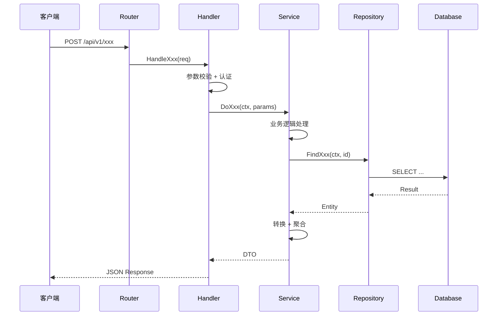
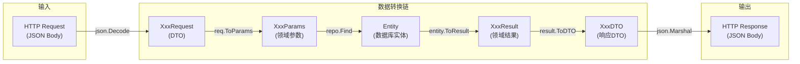
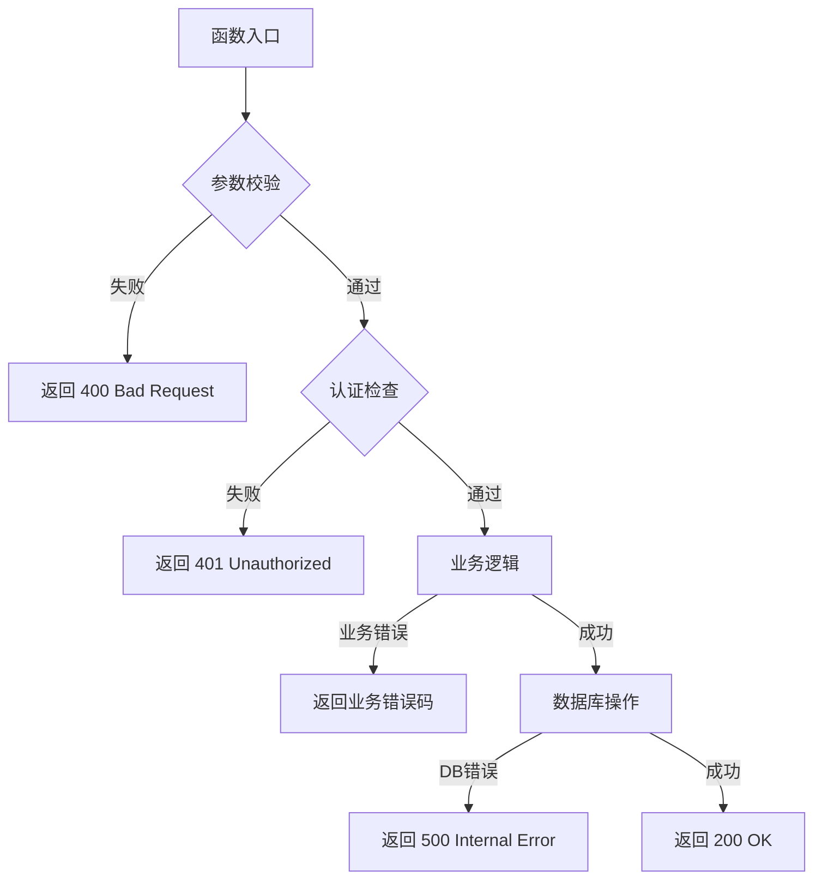
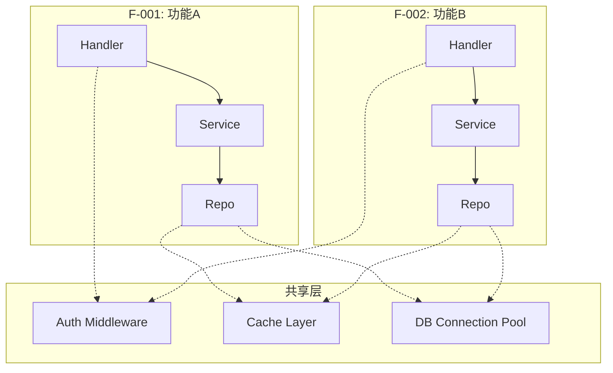
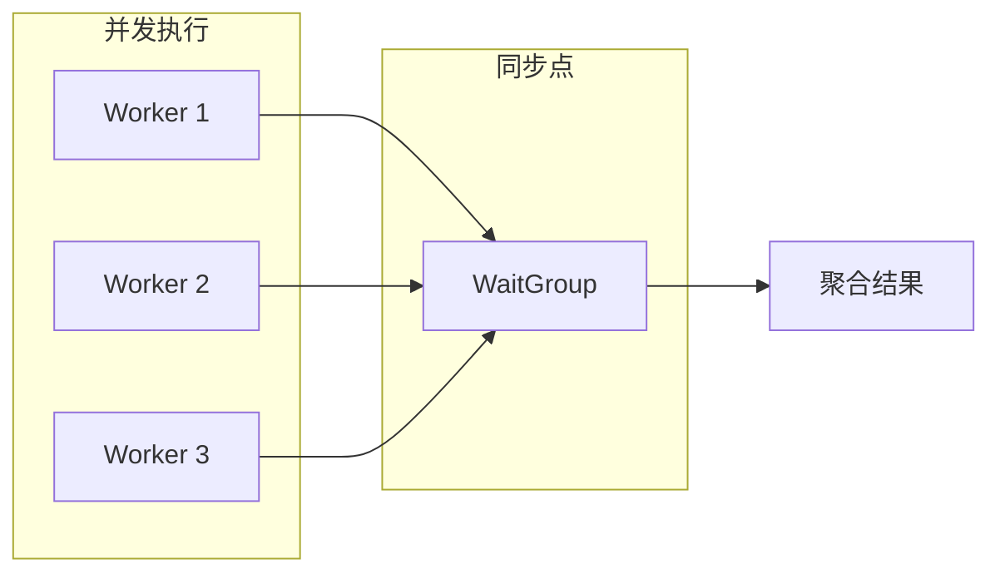
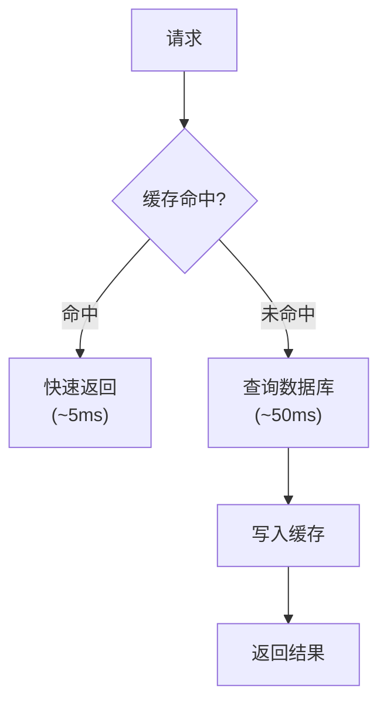

# 功能实现逻辑分析模板

## 文档目的

追踪一个功能从**用户操作/API 入口**到**最终输出**的完整代码路径，分析调用链、数据流转换、关键分支决策、错误处理路径和性能关键路径。

**与核心功能分析的区别**：
- **核心功能分析**：功能"是什么"——功能清单、分类、优先级、依赖关系
- **功能实现逻辑**：功能"怎么做"——代码调用链、数据流、分支决策、异常路径

## 模板结构

```markdown
# [项目名] - 功能实现逻辑分析

## 1. 功能实现概览

### 1.1 分析范围

| 功能ID | 功能名称 | 入口类型 | 入口文件 | 调用深度 | 分析状态 |
|--------|----------|----------|----------|----------|----------|
| F-001 | [功能名] | REST API | `api/handler.go:42` | 8层 | ✅ 已分析 |
| F-002 | [功能名] | CLI 命令 | `cmd/root.go:15` | 5层 | ✅ 已分析 |
| F-003 | [功能名] | 事件触发 | `worker/listener.go:28` | 6层 | ⏳ 待分析 |

### 1.2 入口点分类

| 入口类型 | 入口数量 | 说明 |
|----------|----------|------|
| REST API | N | HTTP 端点 |
| gRPC | N | RPC 调用 |
| CLI 命令 | N | 命令行入口 |
| 事件/消息 | N | 消息队列消费者 |
| 定时任务 | N | Cron/Scheduler |
| WebSocket | N | 长连接入口 |

---

## 2. 功能调用链追踪

### 2.1 [功能名称] (F-001)

#### 调用链总览



#### 调用链详细分析

**Layer 0: 入口层**

| 属性 | 值 |
|------|-----|
| 文件 | `src/api/handler.go` |
| 函数 | `HandleXxx(w http.ResponseWriter, r *http.Request)` |
| 行号 | L42-L78 |
| 职责 | HTTP 请求解析、参数校验、认证检查、响应序列化 |

```go
// 关键代码片段
func (h *Handler) HandleXxx(w http.ResponseWriter, r *http.Request) {
    // 1. 解析请求
    var req XxxRequest
    if err := json.NewDecoder(r.Body).Decode(&req); err != nil {
        h.writeError(w, ErrBadRequest)
        return
    }
    
    // 2. 参数校验
    if err := req.Validate(); err != nil {
        h.writeError(w, err)
        return
    }
    
    // 3. 调用业务层
    result, err := h.service.DoXxx(r.Context(), req.ToParams())
    if err != nil {
        h.writeError(w, err)
        return
    }
    
    // 4. 返回响应
    h.writeJSON(w, result.ToDTO())
}
```

**Layer 1: 业务层**

| 属性 | 值 |
|------|-----|
| 文件 | `src/service/xxx.go` |
| 函数 | `DoXxx(ctx context.Context, params XxxParams) (*XxxResult, error)` |
| 行号 | L15-L89 |
| 职责 | 核心业务逻辑、事务管理、领域规则 |

**关键业务逻辑**：
1. [步骤1]: 说明
2. [步骤2]: 说明
3. [步骤3]: 说明

**Layer 2: 数据层**

| 属性 | 值 |
|------|-----|
| 文件 | `src/repository/xxx.go` |
| 函数 | `FindXxx(ctx context.Context, id string) (*Entity, error)` |
| 行号 | L22-L45 |
| 职责 | 数据持久化、SQL 构建、结果映射 |

#### 关键分支决策点

| # | 位置 | 条件 | 分支A | 分支B | 设计原因 |
|---|------|------|-------|-------|----------|
| 1 | `handler.go:52` | `req.Type == "fast"` | 快速路径(跳过缓存) | 标准路径(查缓存) | 性能优化 |
| 2 | `service.go:34` | `user.Role == Admin` | 跳过权限检查 | 执行权限检查 | 管理员特权 |
| 3 | `repo.go:38` | `result == nil` | 返回 NotFound 错误 | 继续处理 | 空值保护 |

#### 数据流转换



**数据转换详情**：

| 转换点 | 输入类型 | 输出类型 | 转换方法 | 所在文件 |
|--------|----------|----------|----------|----------|
| T1 | JSON → XxxRequest | DTO | `json.Decode` | handler.go:45 |
| T2 | XxxRequest → XxxParams | 领域参数 | `req.ToParams()` | request.go:22 |
| T3 | XxxParams → SQL Query | 数据库查询 | `repo.buildQuery()` | repo.go:30 |
| T4 | DB Row → Entity | 数据库实体 | `sql.Scan` | repo.go:38 |
| T5 | Entity → XxxResult | 领域结果 | `entity.ToResult()` | entity.go:55 |
| T6 | XxxResult → XxxDTO | 响应DTO | `result.ToDTO()` | result.go:30 |

#### 错误处理路径



**错误处理策略**：

| 错误类型 | 处理方式 | 错误码 | 用户可见 | 日志级别 |
|----------|----------|--------|----------|----------|
| 参数校验失败 | 立即返回 | 400 | ✅ | WARN |
| 认证失败 | 立即返回 | 401 | ✅ | WARN |
| 权限不足 | 立即返回 | 403 | ✅ | WARN |
| 资源不存在 | 立即返回 | 404 | ✅ | INFO |
| 业务规则冲突 | 返回业务码 | BIZ_xxx | ✅ | WARN |
| 数据库错误 | 包装返回 | 500 | ❌ | ERROR |
| 外部服务超时 | 重试+降级 | 503 | ❌ | ERROR |

#### 性能关键路径

| 步骤 | 耗时占比 | 瓶颈风险 | 优化手段 |
|------|----------|----------|----------|
| 参数解析 | ~2% | 低 | - |
| 数据库查询 | ~60% | **高** | 索引优化、查询缓存 |
| 业务计算 | ~25% | 中 | 算法优化、并行计算 |
| 响应序列化 | ~3% | 低 | - |
| 网络传输 | ~10% | 中 | 压缩、连接池 |

---

### 2.2 [功能名称] (F-002)

[同上结构]

---

## 3. 跨功能调用链对比

### 3.1 调用链复杂度对比

| 功能 | 调用深度 | 涉及文件数 | 分支数 | 错误处理点数 | 复杂度评级 |
|------|----------|------------|--------|--------------|------------|
| F-001 | 8层 | 6个 | 5个 | 4个 | ⭐⭐⭐ 中等 |
| F-002 | 12层 | 10个 | 8个 | 7个 | ⭐⭐⭐⭐⭐ 复杂 |
| F-003 | 4层 | 3个 | 2个 | 2个 | ⭐ 简单 |

### 3.2 共享代码路径



### 3.3 公共调用路径

| 公共模块 | 被引用次数 | 调用方 | 职责 |
|----------|------------|--------|------|
| `middleware.Auth` | 15 | 所有 Handler | 认证鉴权 |
| `cache.Get` | 8 | 多个 Service | 缓存读取 |
| `db.Query` | 20 | 所有 Repo | 数据库查询 |

---

## 4. 异步与并发分析

### 4.1 异步调用链

| 功能 | 异步点 | 异步方式 | 触发条件 | 完成通知 |
|------|--------|----------|----------|----------|
| F-001 | 发送邮件 | Goroutine + Channel | 注册成功 | 无(异步) |
| F-002 | 生成报告 | 消息队列 | 用户请求 | WebSocket 推送 |

### 4.2 并发控制



**并发模式**：

| 模式 | 使用场景 | 实现方式 | 风险点 |
|------|----------|----------|--------|
| Worker Pool | 批量处理 | `sync.WaitGroup` | 内存溢出 |
| Pipeline | 流式处理 | Channel 链 | 死锁 |
| Fan-out/Fan-in | 并行聚合 | Goroutine + Channel | 竞态条件 |

---

## 5. 缓存与性能路径

### 5.1 缓存命中路径



### 5.2 性能热点分析

| 热点位置 | 文件:行号 | 耗时 | 调用频率 | 优化建议 |
|----------|-----------|------|----------|----------|
| JSON 序列化 | handler.go:72 | 2ms | 1000/s | 使用 jsoniter |
| 数据库查询 | repo.go:38 | 50ms | 500/s | 添加索引 |
| 正则匹配 | validator.go:15 | 0.5ms | 2000/s | 预编译正则 |

---

## 6. 总结与洞察

### 6.1 调用链特征

| 特征 | 描述 |
|------|------|
| **平均调用深度** | X 层 |
| **最长调用链** | F-XXX，X 层 |
| **最复杂功能** | F-XXX，X 个分支 |
| **共享代码比例** | X% |

### 6.2 设计模式识别

| 模式 | 使用位置 | 解决的问题 |
|------|----------|------------|
| 分层架构 | 全局 | 关注点分离 |
| 责任链 | middleware | 请求预处理 |
| 策略模式 | service | 业务规则切换 |
| 观察者 | event bus | 异步通知 |

### 6.3 改进建议

| 优先级 | 建议 | 影响范围 | 预期收益 |
|--------|------|----------|----------|
| P0 | [建议] | F-XXX | 性能提升 X% |
| P1 | [建议] | F-XXX | 代码简化 |
| P2 | [建议] | 全局 | 可维护性提升 |

## REF

### 参考文档
- [核心功能分析](./CORE_FEATURES_ANALYSIS.md)
- [架构设计文档](../01-architecture.md)
- [文件级分析](../20-file-level/)

---

## 💡 设计洞察

> 从该项目的功能实现逻辑中提炼的可移植原则

### 实现逻辑原则

**原则1**: 功能实现应该遵循统一的调用链模式
- **原理**: 统一的调用链模式降低认知负担，便于调试和测试
- **证据**: 项目所有功能遵循 "Controller → Service → Repository → Database" 的四层调用链
- **适用范围**: 需要团队协作的中大型项目
- **去名检验**: ✅ 通用原则

**原则2**: 数据转换应该在明确的边界进行，而非在调用链中随意转换
- **原理**: 明确的数据转换边界便于追踪数据流向，降低数据不一致风险
- **证据**: 项目在 Controller 层做 DTO ↔ Entity 转换，在 Repository 层做 Entity ↔ PO 转换，每层有明确的数据格式
- **适用范围**: 分层架构系统
- **去名检验**: ✅ 通用原则

## ⚠️ 隐含陷阱

> 从功能实现逻辑中发现的非显而易见的陷阱

### 实现逻辑陷阱

**陷阱1**: 调用链过深导致性能问题
- **现象**: 一个简单请求需要调用 10+ 层方法，响应时间超过预期
- **原因**: 过度分层，每层只做简单的委托，没有实际价值
- **正确做法**: 分层应该有明确的价值（如事务管理、权限检查），避免无意义的中间层

**陷阱2**: 跨功能调用导致隐式依赖
- **现象**: 修改功能 A 的代码，意外导致功能 B 出错
- **原因**: 功能 A 和 B 共享了某些内部方法，但没有在接口层面声明依赖
- **正确做法**: 跨功能调用必须通过公共接口，禁止直接调用内部实现；使用依赖注入明确声明依赖关系

**陷阱3**: 异步调用导致调用链断裂
- **现象**: 在异步回调中无法追踪原始请求的上下文（如用户信息、事务上下文）
- **原因**: 异步调用时没有传递上下文信息
- **正确做法**: 使用上下文传递机制（如 Java 的 ThreadLocal、Node.js 的 AsyncLocalStorage），确保异步调用链中上下文不丢失
```
