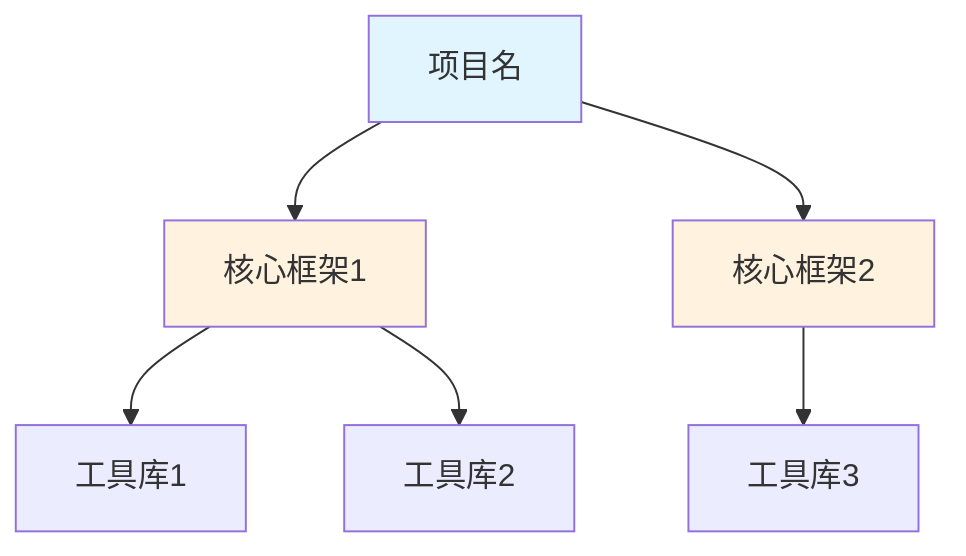

# 项目依赖分析模板

> 🎯 **核心目标**: 梳理项目使用的第三方库，发现值得学习和复用的优秀开源库。
>
> 输出路径: `00-project-level/dependencies.md`

---

## 使用方法

1. 扫描项目的依赖声明文件（package.json / requirements.txt / go.mod / Cargo.toml / pom.xml 等）
2. 分类整理所有依赖
3. 对关键依赖做深度调研
4. 产出「值得关注的优秀库」清单

---

## 模板正文

```markdown
# [项目名] - 项目依赖分析

> 分析时间: YYYY-MM-DD
> 分析模型: `model-name`

## 1. 依赖总览

| 项目 | 信息 |
|------|------|
| 主语言 | Python / TypeScript / Go / ... |
| 包管理器 | pip / npm / go modules / cargo / maven |
| 依赖声明文件 | `package.json` / `requirements.txt` / `go.mod` / ... |
| 锁定文件 | `package-lock.json` / `poetry.lock` / `go.sum` / ... |
| 生产依赖数 | N 个 |
| 开发依赖数 | N 个 |
| 总依赖数（含传递） | N 个 |

## 2. 依赖分类清单

### 2.1 核心框架

> 项目赖以运行的基础框架，移除则项目无法工作

| 依赖名 | 版本 | 用途 | Stars | 最后更新 | 活跃度 | 许可证 |
|--------|------|------|-------|----------|--------|--------|
| express | 4.18.x | HTTP 框架 | 60k+ | 2026-05 | 🟢 活跃 | MIT |
| ... | ... | ... | ... | ... | ... | ... |

### 2.2 工具库

> 提升开发效率的实用库

| 依赖名 | 版本 | 用途 | Stars | 最后更新 | 活跃度 | 许可证 |
|--------|------|------|-------|----------|--------|--------|
| lodash | 4.17.x | 工具函数 | 58k+ | 2026-03 | 🟢 活跃 | MIT |
| ... | ... | ... | ... | ... | ... | ... |

### 2.3 类型/接口增强

> 类型定义、API 客户端、SDK 等

| 依赖名 | 版本 | 用途 | Stars | 活跃度 | 许可证 |
|--------|------|------|-------|--------|--------|
| ... | ... | ... | ... | ... | ... |

### 2.4 开发依赖

> 构建、测试、Lint、格式化等开发时工具

| 依赖名 | 版本 | 用途 | 活跃度 |
|--------|------|------|--------|
| typescript | 5.x | 类型系统 | 🟢 |
| jest | 29.x | 测试框架 | 🟢 |
| eslint | 8.x | 代码检查 | 🟢 |
| ... | ... | ... | ... |

### 2.5 可选/按需依赖

> 平台特定、条件加载的依赖

| 依赖名 | 触发条件 | 用途 |
|--------|----------|------|
| ... | ... | ... |

## 3. ⭐ 值得关注的优秀库（核心产出）

> 从所有依赖中筛选出设计优秀、值得学习和复用的开源库。
> 评级标准: ⭐ 值得了解 | ⭐⭐ 值得学习 | ⭐⭐⭐ 强烈推荐

### ⭐⭐⭐ 强烈推荐

#### [库名]

| 属性 | 信息 |
|------|------|
| GitHub | https://github.com/xxx |
| Stars | Nk |
| 许可证 | MIT |
| 当前版本 | x.y.z |
| 用在本项目哪里 | 文件:行号，做什么 |
| 为什么好 | 一句话亮点 |

**深度点评**:

- **解决了什么问题**: ...
- **设计亮点**: ...
- **API 设计**: ...
- **可学习/复用的点**: ...
- **替代方案**: ...（对比）
- **注意事项**: ...

**使用示例**:
```language
// 从本项目中提取的典型用法
```

---

### ⭐⭐ 值得学习

#### [库名]
| 属性 | 信息 |
|------|------|
| GitHub | ... |
| Stars | ... |
| 用在本项目哪里 | ... |
| 为什么好 | ... |

**简评**: 2-3 句话说明亮点和可学习之处。

---

### ⭐ 值得了解

简要列出有特色的库，一句话说明：

- **[库名]** (Stars) — 一句话亮点
- **[库名]** (Stars) — 一句话亮点

## 4. 依赖关系图



## 5. 依赖健康度

### 5.1 版本新鲜度

| 状态 | 数量 | 占比 |
|------|------|------|
| 🟢 最新（< 6 个月） | N | N% |
| 🟡 较新（6-12 个月） | N | N% |
| 🟠 过期（1-2 年） | N | N% |
| 🔴 严重过期（> 2 年） | N | N% |

### 5.2 风险依赖

| 依赖 | 风险类型 | 说明 | 建议 |
|------|----------|------|------|
| [库名] | 🔴 已弃用 | 已停止维护 | 迁移到 [替代库] |
| [库名] | 🟡 安全漏洞 | CVE-XXXX | 升级到 x.y.z |
| [库名] | 🟡 许可证风险 | GPL 传染性 | 评估合规风险 |
| [库名] | 🟠 版本锁定 | 锁定在 x.y.z | 检查兼容性 |

## 6. 技术选型观察

> 从依赖选择看项目的技术品味和设计哲学

- **技术栈定位**: （如: 偏好轻量 / 追求极致性能 / 生态优先）
- **自研 vs 复用**: 项目偏好自己造轮子还是善用现有库？
- **风格一致性**: 依赖选择是否风格统一？
- **独特选择**: 有没有不常见但很巧妙的库选择？

---

*模板版本: v1.0*
```

---

## 扫描命令参考

不同语言的依赖文件扫描：

```bash
# Node.js / TypeScript
cat package.json | jq '.dependencies, .devDependencies'
cat package-lock.json | jq '.packages | keys'

# Python
cat requirements.txt
cat pyproject.toml | jq '.dependencies, .tool.poetry.dependencies'
pip freeze

# Go
cat go.mod
go list -m all

# Rust
cat Cargo.toml
cat Cargo.lock

# Java / Kotlin (Maven)
cat pom.xml | grep '<dependency>'

# Java / Kotlin (Gradle)
cat build.gradle | grep 'implementation\|api\|compileOnly'

# Ruby
cat Gemfile
cat Gemfile.lock

# PHP
cat composer.json | jq '.require, .require-dev'

# Swift
cat Package.swift | grep '.package'
```

## 活跃度判断标准

| 标记 | 含义 | 判断依据 |
|------|------|----------|
| 🟢 活跃 | 持续维护 | 最近 commit < 3 个月，有定期 release |
| 🟡 维护中 | 低频维护 | 最近 commit 3-12 个月，偶尔更新 |
| 🟠 停滞 | 几乎不维护 | 最近 commit 1-2 年 |
| 🔴 弃用 | 已废弃 | 最近 commit > 2 年，或标记 deprecated |
