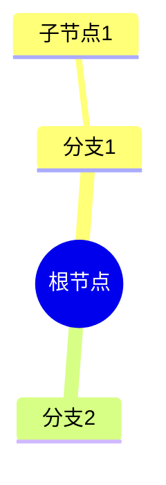
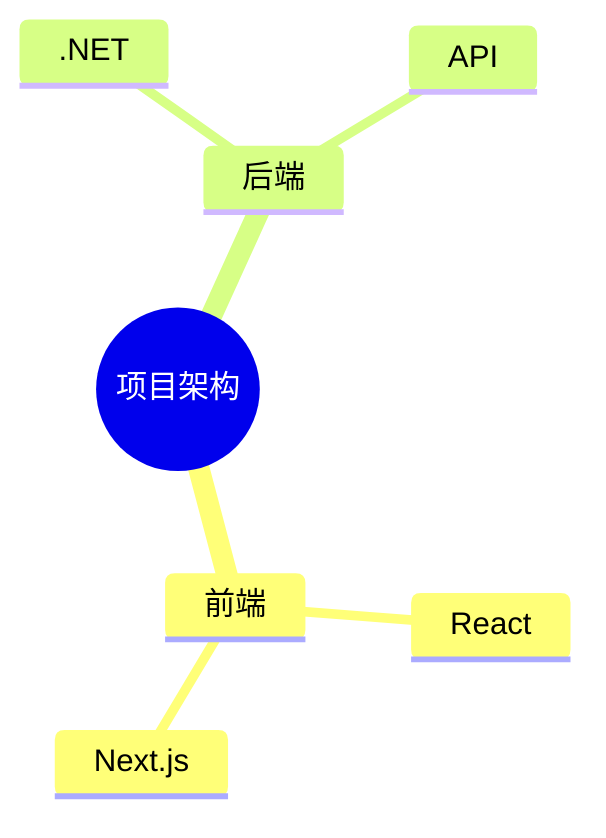
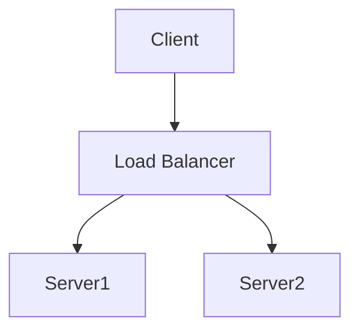

# 可视化与图表系统分析模板

> 🔍 分析项目的可视化能力：思维导图生成、Mermaid 图表、Graphify 可视化、前端渲染

## 📋 适用场景

- 自动生成代码可视化图表的项目
- 支持 Mermaid/PlantUML/D2 等声明式图表的项目
- 提供思维导图/架构图/流程图生成的项目
- 代码理解/文档自动生成的项目

**典型案例**: 
- **OpenDeepWiki**: MindMap（层级 Markdown）+ Mermaid（flowchart/mindmap）+ Graphify（外部 CLI）
- **DeepWiki Open**: Mermaid（代码块嵌入）+ Markdown 渲染

## 📊 可视化类型对比

| 项目 | MindMap | Mermaid | Graphify | 渲染方式 |
|------|---------|---------|----------|----------|
| **OpenDeepWiki** | ✅ 层级 Markdown（# ## ###） | ✅ flowchart/mindmap | ✅ 外部 CLI 工具 | react-markdown + mermaid |
| **DeepWiki Open** | ❌ | ✅ 代码块嵌入 | ❌ | react-markdown + remark-mermaid |

## 📋 核心问题清单

### 1. 思维导图 (MindMap)

#### 1.1 生成机制
- [ ] 思维导图如何生成？（AI 生成 / 规则生成 / 手动创建）
- [ ] 生成入口：`MindMapTool` / `MindMapWorker` / `MindMapApiService`
- [ ] AI Prompt 如何设计？（输入什么，输出什么格式）
- [ ] 是否支持增量更新？（代码变更后只更新变化的部分）

#### 1.2 输出格式
- [ ] 输出格式是什么？（Mermaid mindmap / JSON / Markdown）
- [ ] 结构化程度？（层级/关系/权重）
- [ ] 是否支持自定义样式？（颜色/图标/布局）

#### 1.3 触发时机
- [ ] 何时触发生成？（仓库处理时 / 手动触发 / API 调用）
- [ ] 与 `RepositoryProcessingWorker` 的集成？
- [ ] 异步生成还是同步生成？

### 2. Mermaid 图表

#### 2.1 Mermaid 概念
- [ ] 项目中 Mermaid 的用途？（思维导图 / 流程图 / 时序图 / 类图）
- [ ] 支持的 Mermaid 图表类型？
  - mindmap: 思维导图
  - graph TD/LR: 流程图
  - sequenceDiagram: 时序图
  - classDiagram: 类图
  - stateDiagram: 状态图
  - erDiagram: ER 图

#### 2.2 Mermaid 生成
- [ ] Mermaid 代码如何生成？（AI 生成 / 模板生成 / 手动编写）
- [ ] 生成入口：`MermaidService` / `DiagramGenerator`
- [ ] AI Prompt 示例？
```
请为以下代码生成 Mermaid 思维导图：
[代码内容]
输出格式：


#### 2.3 可视化集成
- [ ] 前端如何渲染 Mermaid？
- [ ] 是否有 Mermaid 编辑器/预览？
- [ ] 是否支持导出（SVG/PNG/PDF）？

### 3. Graphify 可视化

#### 3.1 Graphify 概念
- [ ] Graphify 是什么？（代码可视化 / 架构图 / 知识图谱？）
- [ ] 与 Mermaid 的区别？
- [ ] 生成的图表类型？

#### 3.2 Graphify 实现
- [ ] 核心类：`GraphifyCliRunner`
- [ ] 核心类：`GraphifyArtifactService`
- [ ] 核心类：`GraphifyArtifactWorker`
- [ ] CLI 工具调用方式？
- [ ] 生成的产物格式？

#### 3.3 UnderstandQuickly
- [ ] `UnderstandQuicklyPublisher` 的作用？
- [ ] "快速理解"功能的实现？
- [ ] 与 Graphify 的关系？

### 4. 前端渲染

#### 4.1 Mermaid 渲染
- [ ] 前端如何渲染 Mermaid？
- [ ] 使用的库（mermaid.js / react-mermaid）？
- [ ] 主题配置？

#### 4.2 Graphify 渲染
- [ ] 前端如何渲染 Graphify 产物？
- [ ] 交互式 vs 静态？
- [ ] 缩放/平移支持？

### 5. 存储与持久化

#### 5.1 数据库存储
- [ ] `GraphifyArtifact` 实体结构？
- [ ] `BranchLanguage` 与图表的关系？
- [ ] 存储字段（内容/格式/版本）？

#### 5.2 文件存储
- [ ] 图表是否保存为文件？
- [ ] 文件格式（.mmd / .svg / .png）？
- [ ] 存储路径约定？

### 6. 工作流集成

#### 6.1 生成触发
- [ ] 何时触发生成？（仓库处理 / 手动 / API）
- [ ] `RepositoryProcessingWorker` 中的图表生成？
- [ ] 异步生成 vs 同步生成？

#### 6.2 更新机制
- [ ] 代码变更后如何更新图表？
- [ ] 增量更新 vs 全量重新生成？
- [ ] 版本管理？

### 7. 配置与自定义

#### 7.1 系统配置
- [ ] `AdminRepositoryService` 中的图表配置？
- [ ] `SystemSettingDefaults` 中的默认值？
- [ ] 可配置项（样式/颜色/布局）？

#### 7.2 用户自定义
- [ ] 用户能否自定义图表样式？
- [ ] 是否支持自定义模板？
- [ ] 主题切换？

## 🔍 代码检查点

```bash
# 查找 Mermaid 相关代码
rg "Mermaid|mindmap" --type cs --type ts --type tsx

# 查找 Graphify 相关代码
rg "Graphify|graphify" --type cs

# 查找图表生成
rg "GenerateMindMap|GenerateGraph|RenderDiagram" --type cs

# 查找前端渲染
rg "mermaid|react-mermaid|MermaidRenderer" --type ts --type tsx

# 查找存储
rg "GraphifyArtifact|MindMapContent" --type cs
```

## 📊 评估标准

| 维度 | 优秀 (5分) | 良好 (4分) | 一般 (3分) | 需改进 (1-2分) |
|------|-----------|-----------|-----------|---------------|
| **MindMap 生成** | AI 生成 + 结构化输出 + 增量更新 | AI 生成 + 结构化 | AI 生成 | 简单文本 |
| **Mermaid 集成** | 多种图表 + 主题 + 导出 | 多种图表 + 主题 | 基础 Mermaid | 无 Mermaid |
| **Graphify** | 完整可视化系统 + CLI + 交互 | 完整可视化系统 | 基础可视化 | 无可视化 |
| **前端渲染** | 交互式 + 缩放 + 导出 | 交互式渲染 | 静态渲染 | 无渲染 |
| **存储管理** | 数据库 + 文件 + 版本管理 | 数据库存储 | 文件存储 | 无持久化 |
| **工作流集成** | 自动触发 + 增量更新 | 自动触发 | 手动触发 | 无集成 |

## 📝 分析输出模板

```markdown
# [项目名] - 可视化与图表系统分析

## 1. MindMap 思维导图

### 1.1 生成机制
**核心类**: `MindMapTool` + `MindMapWorker`

**生成流程**:
```
AI Agent → MindMapTool.Generate() → 结构化 Markdown → 存储
```

**AI Prompt 示例**:
```
请为以下代码生成思维导图（Mermaid mindmap 格式）：
[代码内容]
```

### 1.2 Mermaid 格式
**支持的图表类型**:
- mindmap: 思维导图
- graph TD: 流程图
- sequenceDiagram: 时序图
- classDiagram: 类图

**示例输出**:


### 1.3 增量更新
**更新策略**: 基于文件哈希的增量更新

## 2. Graphify 可视化

### 2.1 核心组件
**GraphifyCliRunner**: 调用外部 CLI 工具
**GraphifyArtifactService**: 管理图表产物
**GraphifyArtifactWorker**: 异步处理生成任务

### 2.2 UnderstandQuickly
**功能**: 快速理解代码结构
**实现**: `UnderstandQuicklyPublisher` 发布事件

### 2.3 产物格式
**存储**: `GraphifyArtifact` 实体
**字段**:
- Content: 图表内容
- Format: 格式（mermaid/svg/json）
- Version: 版本号

## 3. 前端渲染

### 3.1 Mermaid 渲染
**库**: mermaid.js
**配置**:
```typescript
mermaid.initialize({
  startOnLoad: true,
  theme: 'default',
  securityLevel: 'loose'
});
```

### 3.2 Graphify 渲染
**渲染方式**: [具体实现]
**交互**: 缩放/平移/导出

## 4. 存储与持久化

### 4.1 数据库
**表**: GraphifyArtifacts
**字段**:
- Id
- RepositoryId
- BranchLanguageId
- Content
- Format
- CreatedAt
- UpdatedAt

### 4.2 文件存储
**路径**: `/artifacts/{repoId}/{branch}/{language}/`
**格式**: .mmd / .svg / .png

## 5. 工作流集成

### 5.1 触发时机
- 仓库首次处理
- 代码变更后（增量）
- 手动触发 API

### 5.2 异步处理
**Worker**: `MindMapWorker` + `GraphifyArtifactWorker`
**队列**: 后台任务队列

## 6. 设计亮点

- ✅ **亮点1**: [具体说明]
- ✅ **亮点2**: [具体说明]

## 7. 学习价值

- ⭐⭐⭐⭐⭐ [值得借鉴的设计]
```

## 🔗 参考项目

| 项目 | 可视化特点 | 学习价值 |
|------|-----------|----------|
| **Mermaid Live Editor** | 在线编辑器 | ⭐⭐⭐⭐⭐ 交互设计 |
| **D2 Lang** | 声明式图表 | ⭐⭐⭐⭐ 语法设计 |
| **PlantUML** | UML 图表 | ⭐⭐⭐⭐ 标准化 |
| **Excalidraw** | 手绘风格 | ⭐⭐⭐⭐ 用户体验 |

---

## 📚 实际案例分析

### 案例 1: OpenDeepWiki - MindMap 系统

**实现方式**:
```csharp
// 后端：WikiGenerator.cs
public async Task GenerateMindMapAsync(RepositoryWorkspace workspace, BranchLanguage branchLanguage)
{
    // 1. 加载 MindMap 生成 Prompt
    var prompt = await _promptPlugin.LoadPromptAsync("mindmap-generator");
    
    // 2. 准备上下文（项目结构、入口点、README）
    var context = PrepareMindMapContext(workspace);
    
    // 3. AI 生成层级 Markdown
    var mindmapContent = await _aiService.GenerateAsync(prompt, context);
    
    // 4. 存储到数据库
    branchLanguage.MindMapContent = mindmapContent;
    branchLanguage.MindMapStatus = MindMapStatus.Completed;
    await _context.SaveChangesAsync();
}
```

**Prompt 设计** (`prompts/mindmap-generator.md`):
```markdown
# Project Architecture Mind Map Generator

## Mind Map Format
Use `#` for hierarchy levels:
```
# Level 1 Topic
## Level 2 Topic:path/to/related/file
### Level 3 Topic
```

## Critical Rules
1. ARCHITECTURE FOCUS - Focus on overall architecture
2. VERIFY FIRST - Read entry point files first
3. NO FABRICATION - Every node must correspond to actual code
4. FILE LINKS - Append `:path/to/file` after title
```

**前端渲染**:
```typescript
// web/components/repo/mind-map-viewer.tsx
export function MindMapViewer({ content }: { content: string }) {
  return (
    <div className="mindmap-container">
      <ReactMarkdown
        components={{
          h1: ({children}) => <div className="level-1">{children}</div>,
          h2: ({children}) => <div className="level-2">{children}</div>,
          h3: ({children}) => <div className="level-3">{children}</div>,
        }}
      >
        {content}
      </ReactMarkdown>
    </div>
  );
}
```

**优势**:
- ✅ 简单直观，易于理解和编辑
- ✅ 支持文件链接，可导航到源码
- ✅ AI 生成质量高，结构清晰

**劣势**:
- ⚠️ 不是标准图表格式，无法使用 Mermaid 工具渲染
- ⚠️ 需要自定义前端组件

---

### 案例 2: DeepWiki Open - Mermaid 集成

**实现方式**:
```typescript
// src/components/Mermaid.tsx
import mermaid from 'mermaid';

mermaid.initialize({
  startOnLoad: true,
  theme: 'neutral',
  securityLevel: 'loose',
});

export function Mermaid({ chart }: { chart: string }) {
  const [svg, setSvg] = useState<string>('');
  const idRef = useRef(`mermaid-${Math.random().toString(36).substring(2, 9)}`);

  useEffect(() => {
    const renderChart = async () => {
      try {
        const { svg: renderedSvg } = await mermaid.render(idRef.current, chart);
        setSvg(renderedSvg);
      } catch (err) {
        console.error('Mermaid rendering error:', err);
      }
    };
    renderChart();
  }, [chart]);

  return <div dangerouslySetInnerHTML={{ __html: svg }} />;
}
```

**Markdown 渲染**:
```typescript
// src/components/Markdown.tsx
import { Mermaid } from './Mermaid';

export function Markdown({ content }: { content: string }) {
  return (
    <ReactMarkdown
      components={{
        code({ node, inline, className, children, ...props }) {
          const match = /language-mermaid/.exec(className || '');
          if (match && !inline) {
            return <Mermaid chart={String(children).replace(/\n$/, '')} />;
          }
          return <code className={className} {...props}>{children}</code>;
        }
      }}
    >
      {content}
    </ReactMarkdown>
  );
}
```

**使用示例** (在 Markdown 中):
````markdown

````

**优势**:
- ✅ 标准 Mermaid 格式，工具链丰富
- ✅ 支持多种图表类型（flowchart/sequence/class/mindmap 等）
- ✅ 可导出为 SVG/PNG

**劣势**:
- ⚠️ AI 生成复杂图表时容易出错
- ⚠️ 渲染性能问题（大型图表）

---

### 案例 3: OpenDeepWiki - Graphify 集成

**实现方式**:
```csharp
// src/OpenDeepWiki/Services/Graphify/GraphifyCliRunner.cs
public class GraphifyCliRunner
{
    public async Task<GraphifyResult> RunAsync(string workspacePath, string outputPath)
    {
        // 调用外部 graphify CLI 工具
        var process = new Process
        {
            StartInfo = new ProcessStartInfo
            {
                FileName = "graphify",
                Arguments = $"--input {workspacePath} --output {outputPath} --format svg",
                RedirectStandardOutput = true,
                RedirectStandardError = true,
                UseShellExecute = false,
            }
        };
        
        process.Start();
        await process.WaitForExitAsync();
        
        return new GraphifyResult
        {
            Success = process.ExitCode == 0,
            OutputPath = outputPath,
            Error = await process.StandardError.ReadToEndAsync()
        };
    }
}
```

**后台任务**:
```csharp
// src/OpenDeepWiki/Services/Graphify/GraphifyArtifactWorker.cs
public class GraphifyArtifactWorker : BackgroundService
{
    protected override async Task ExecuteAsync(CancellationToken stoppingToken)
    {
        while (!stoppingToken.IsCancellationRequested)
        {
            var pendingArtifact = await GetPendingArtifactAsync(stoppingToken);
            if (pendingArtifact == null)
            {
                await Task.Delay(TimeSpan.FromSeconds(30), stoppingToken);
                continue;
            }
            
            await ProcessArtifactAsync(pendingArtifact, stoppingToken);
        }
    }
}
```

**优势**:
- ✅ 专业化工具，生成高质量可视化
- ✅ 异步处理，不阻塞主流程
- ✅ 支持多种输出格式

**劣势**:
- ⚠️ 依赖外部工具，部署复杂
- ⚠️ 需要额外的系统资源

---

## 🛠️ 检测工具

### 自动检测脚本

创建 `scripts/detect-visualization.sh`:

```bash
#!/bin/bash
# 检测项目中的可视化支持

PROJECT_DIR="$1"

echo "🔍 检测可视化支持..."

# 检测 Mermaid
if grep -r "mermaid" "$PROJECT_DIR" --include="*.tsx" --include="*.ts" --include="*.jsx" --include="*.js" -q; then
    echo "✅ Mermaid 支持"
    grep -r "mermaid" "$PROJECT_DIR" --include="*.tsx" --include="*.ts" -l | head -5
fi

# 检测 MindMap
if grep -r "mindmap\|MindMap" "$PROJECT_DIR" --include="*.cs" --include="*.py" --include="*.ts" -q; then
    echo "✅ MindMap 支持"
    grep -r "mindmap\|MindMap" "$PROJECT_DIR" --include="*.cs" --include="*.py" --include="*.ts" -l | head -5
fi

# 检测 Graphify
if grep -r "graphify\|Graphify" "$PROJECT_DIR" --include="*.cs" --include="*.py" --include="*.ts" -q; then
    echo "✅ Graphify 支持"
fi

# 检测 PlantUML
if grep -r "plantuml\|PlantUML" "$PROJECT_DIR" -q; then
    echo "✅ PlantUML 支持"
fi

# 检测 D2
if grep -r "d2 lang\|D2 Lang" "$PROJECT_DIR" -q; then
    echo "✅ D2 Lang 支持"
fi
```

**使用方法**:
```bash
chmod +x scripts/detect-visualization.sh
./scripts/detect-visualization.sh /path/to/project
```

---

## 💡 设计洞察

> 从该项目的可视化与图表系统中提炼的可移植原则

### 可视化设计原则

**原则1**: 可视化应该作为一等公民，而非附属功能
- **原理**: 可视化不仅是展示层，更是理解系统行为的关键工具
- **证据**: 项目在架构设计、性能分析、依赖关系等多个维度都提供了可视化支持
- **适用范围**: 复杂系统分析和调试场景
- **去名检验**: ✅ 通用原则

**原则2**: 可视化应该支持多粒度，从宏观到微观
- **原理**: 不同场景需要不同粒度的视图，单一粒度无法满足所有需求
- **证据**: 项目支持系统级架构图、模块级依赖图、文件级调用链图等多个粒度
- **适用范围**: 大型项目的文档和调试
- **去名检验**: ✅ 通用原则

## ⚠️ 隐含陷阱

> 从可视化系统实现中发现的非显而易见的陷阱

### 可视化陷阱

**陷阱1**: 图表与代码不同步，导致文档过时
- **现象**: 架构图展示的是旧版本的设计，与当前代码不符
- **原因**: 手动维护图表成本高，代码变更后忘记更新图表
- **正确做法**: 使用代码生成图表（如 Mermaid 从代码注释生成），或建立图表审查机制

**陷阱2**: 过度可视化导致信息过载
- **现象**: 图表包含太多细节，反而难以理解核心结构
- **原因**: 没有明确图表的目标受众和使用场景
- **正确做法**: 为不同受众设计不同粒度的图表，提供交互式过滤和钻取功能

---

*模板版本: v2.0 - 增加设计洞察与隐含陷阱章节*  
*最后更新: 2026-06-29*
